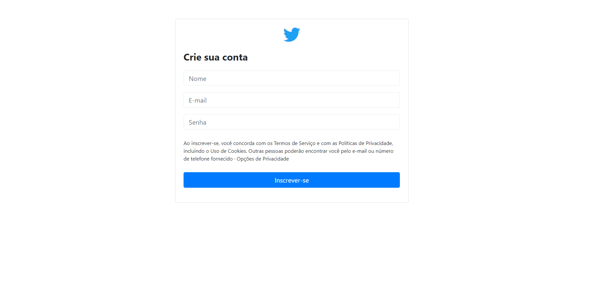

# Twitter Clone
Este é um repositório do projeto: Twitter Clone. Desenvolvido em PHP, utilizando padrões da orientação a objetos.
Utilizando padrões de arquitetura MVC com o modelo PSR-4. 

## PROJETO


<br>


## Como instalar

Clone da aplicação para alguma pasta de sua escolha

```
$ git clone https://github.com/SAwarm/TwitterClone.git
```

Entre nas pastas

```
$ cd TwitterClone
$ cd public
```

Inicialize o servidor para usar

```
$ php -S localhost:8080
```