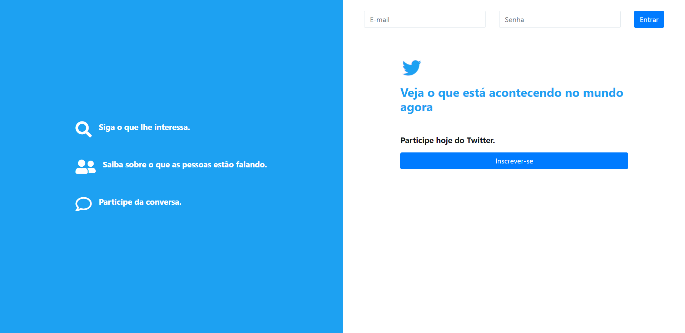

# Twitter Clone
Este é um repositório do Twitter Clone. Desenvolvido em PHP, utilizando padrões da orientação a obejtos.
Utilizando padrões de arquitetura MVC com o modelo PSR-4. 

## Fotos de algumas telas

